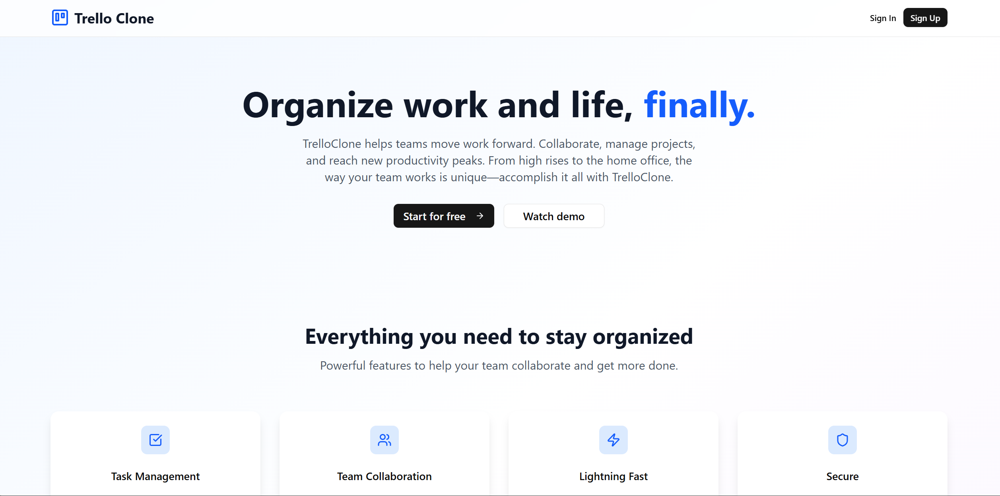

---

# Trello Clone App with Next.js & Supabase

<div align="center">

  <div>
    
    
    
    
    
  </div>
  <h3 align="center">Trello‑Style App with Next.js, Supabase, Clerk & dnd‑kit</h3>
 
  <br />
</div>

## 📋 Table of Contents

1. [Introduction](#-introduction)
2. [Tech Stack](#-tech-stack)
3. [Features](#-features)
4. [Quick Start](#-quick-start)
5. [Screenshots](#-screenshots)
6. [Deployment](#-deployment)

---

## 🚀 Introduction

A production‑ready **Trello‑Style App** using **Next.js**, **Supabase**, **Clerk**, **dnd‑kit**, and **TailwindCSS**. You’ll implement **real‑time data**, **authentication & billing**, **drag‑and‑drop**, and **filtering**, all deployed to Vercel.

---

## ⚙️ Tech Stack

- **Next.js** – React framework with file‑based routing & server components
- **Supabase** – Hosted Postgres, real‑time subscriptions & Storage
- **Clerk** – Authentication & subscription billing integration
- **@dnd-kit** – Flexible drag‑and‑drop primitives
- **TailwindCSS** – Utility‑first styling
- **TypeScript** – Static typing and developer tooling

---

## ⚡️ Features

- 📋 **Boards & Columns**
  Create multiple boards and define custom columns.

- ➕ **Dynamic Tasks**
  Add, edit and delete tasks with title, description, assignee, priority & due date.

- 🔄 **Drag & Drop**
  Reorder tasks and move them between columns with smooth animations.

- 📡 **Real‑Time Updates**
  Changes sync instantly across clients via Supabase subscriptions.

- 🔍 **Filtering**
  Filter tasks by priority, due date, and search within a board.

- 🔐 **Auth & Billing**
  Sign up / log in with Clerk and upgrade your plan to create unlimited boards.

- 🚀 **One‑Click Deployment**
  Deploy the app on Vercel with environment variables for Supabase & Clerk.

---
## 🖼️ Screenshots

> 📸 

## <div></div>

---

## 👌 Quick Start

### Prerequisites

- [Node.js](https://nodejs.org/) (v16+)
- [Supabase CLI](https://supabase.com/docs/guides/cli)
- Supabase project (URL & ANON key)
- Clerk account (Publishable & Secret keys)

### Supabase SQL Statements:

- Creates **helper function**, **tables** (`boards`, `columns`, `tasks`)
- Adds FKs, defaults, and useful indexes
- Enables **RLS**
- Adds all **policies** you described (plus the missing `boards` ones)

```sql
-- =========================================================
-- 0. Helper: get the requesting user's id from JWT
-- =========================================================
CREATE OR REPLACE FUNCTION requesting_user_id()
RETURNS text AS $$
  SELECT NULLIF(
    current_setting('request.jwt.claims', true)::json->>'sub',
    ''
  )::text;
$$ LANGUAGE SQL STABLE;

-- =========================================================
-- 1. Tables
-- =========================================================

-- Boards
CREATE TABLE IF NOT EXISTS public.boards (
  id          bigint GENERATED BY DEFAULT AS IDENTITY PRIMARY KEY,
  created_at  timestamptz NOT NULL DEFAULT now(),
  updated_at  timestamptz NOT NULL DEFAULT now(),
  title       text NOT NULL,
  description text,
  color       text,
  user_id     text NOT NULL
);

-- Columns
CREATE TABLE IF NOT EXISTS public.columns (
  id          bigint GENERATED BY DEFAULT AS IDENTITY PRIMARY KEY,
  created_at  timestamptz NOT NULL DEFAULT now(),
  board_id    bigint NOT NULL REFERENCES public.boards(id) ON DELETE CASCADE,
  title       text NOT NULL,
  sort_order  int4 NOT NULL DEFAULT 0,
  user_id     text NOT NULL
);

-- Tasks
CREATE TABLE IF NOT EXISTS public.tasks (
  id          bigint GENERATED BY DEFAULT AS IDENTITY PRIMARY KEY,
  created_at  timestamptz NOT NULL DEFAULT now(),
  title       text NOT NULL,
  description text,
  assignee    text,
  due_date    date,
  priority    text,
  sort_order  int4 NOT NULL DEFAULT 0,
  column_id   bigint NOT NULL REFERENCES public.columns(id) ON DELETE CASCADE
);

-- Optional: keep boards.updated_at fresh
CREATE OR REPLACE FUNCTION public.set_updated_at()
RETURNS trigger AS $$
BEGIN
  NEW.updated_at = now();
  RETURN NEW;
END;
$$ LANGUAGE plpgsql;

DROP TRIGGER IF EXISTS trg_boards_updated_at ON public.boards;
CREATE TRIGGER trg_boards_updated_at
BEFORE UPDATE ON public.boards
FOR EACH ROW EXECUTE FUNCTION public.set_updated_at();

-- Helpful indexes
CREATE INDEX IF NOT EXISTS idx_columns_board_id ON public.columns(board_id);
CREATE INDEX IF NOT EXISTS idx_tasks_column_id  ON public.tasks(column_id);

-- =========================================================
-- 2. Enable Row Level Security
-- =========================================================
ALTER TABLE public.boards  ENABLE ROW LEVEL SECURITY;
ALTER TABLE public.columns ENABLE ROW LEVEL SECURITY;
ALTER TABLE public.tasks   ENABLE ROW LEVEL SECURITY;

-- =========================================================
-- 3. Policies
-- =========================================================

--------------------------
-- BOARDS TABLE POLICIES
--------------------------

-- View own boards
CREATE POLICY "Users can view their own boards"
ON public.boards
FOR SELECT
USING (user_id = requesting_user_id()::text);

-- Insert own boards
CREATE POLICY "Users can insert their own boards"
ON public.boards
FOR INSERT
WITH CHECK (requesting_user_id() = user_id);

-- Update own boards
CREATE POLICY "Users can update their own boards"
ON public.boards
FOR UPDATE
USING (user_id = requesting_user_id())
WITH CHECK (user_id = requesting_user_id());

-- Delete own boards
CREATE POLICY "Users can delete their own boards"
ON public.boards
FOR DELETE
USING (user_id = requesting_user_id());

--------------------------
-- COLUMNS TABLE POLICIES
--------------------------

-- Users can view columns from their own boards
CREATE POLICY "Users can view columns from their own boards" ON public.columns
FOR SELECT USING (
  EXISTS (
    SELECT 1 FROM public.boards
    WHERE boards.id = columns.board_id
      AND boards.user_id = requesting_user_id()
  )
);

-- Users can insert columns into their own boards
CREATE POLICY "Users can insert columns into their own boards" ON public.columns
FOR INSERT WITH CHECK (
  EXISTS (
    SELECT 1 FROM public.boards
    WHERE boards.id = columns.board_id
      AND boards.user_id = requesting_user_id()
  )
);

-- Users can update columns from their own boards
CREATE POLICY "Users can update columns from their own boards" ON public.columns
FOR UPDATE USING (
  EXISTS (
    SELECT 1 FROM public.boards
    WHERE boards.id = columns.board_id
      AND boards.user_id = requesting_user_id()
  )
)
WITH CHECK (
  EXISTS (
    SELECT 1 FROM public.boards
    WHERE boards.id = columns.board_id
      AND boards.user_id = requesting_user_id()
  )
);

-- Users can delete columns from their own boards
CREATE POLICY "Users can delete columns from their own boards" ON public.columns
FOR DELETE USING (
  EXISTS (
    SELECT 1 FROM public.boards
    WHERE boards.id = columns.board_id
      AND boards.user_id = requesting_user_id()
  )
);

-----------------------
-- TASKS TABLE POLICIES
-----------------------

-- Users can view tasks from their own boards
CREATE POLICY "Users can view tasks from their own boards" ON public.tasks
FOR SELECT USING (
  EXISTS (
    SELECT 1 FROM public.columns
    JOIN public.boards ON boards.id = columns.board_id
    WHERE columns.id = tasks.column_id
      AND boards.user_id = requesting_user_id()
  )
);

-- Users can insert tasks into their own boards
CREATE POLICY "Users can insert tasks into their own boards" ON public.tasks
FOR INSERT WITH CHECK (
  EXISTS (
    SELECT 1 FROM public.columns
    JOIN public.boards ON boards.id = columns.board_id
    WHERE columns.id = tasks.column_id
      AND boards.user_id = requesting_user_id()
  )
);

-- Users can update tasks from their own boards
CREATE POLICY "Users can update tasks from their own boards" ON public.tasks
FOR UPDATE USING (
  EXISTS (
    SELECT 1 FROM public.columns
    JOIN public.boards ON boards.id = columns.board_id
    WHERE columns.id = tasks.column_id
      AND boards.user_id = requesting_user_id()
  )
)
WITH CHECK (
  EXISTS (
    SELECT 1 FROM public.columns
    JOIN public.boards ON boards.id = columns.board_id
    WHERE columns.id = tasks.column_id
      AND boards.user_id = requesting_user_id()
  )
);

-- Users can delete tasks from their own boards
CREATE POLICY "Users can delete tasks from their own boards" ON public.tasks
FOR DELETE USING (
  EXISTS (
    SELECT 1 FROM public.columns
    JOIN public.boards ON boards.id = columns.board_id
    WHERE columns.id = tasks.column_id
      AND boards.user_id = requesting_user_id()
  )
);
```

### Clone and Run

```bash
git clone https://github.com/yourusername/trello-clone-next-supabase.git
cd trello-clone-next-supabase
npm install
```

1. Copy `.env.example` to `.env.local` and fill in your Supabase & Clerk credentials.
2. Start local Supabase emulation (optional):

   ```bash
   supabase start
   supabase db push
   ```

3. Run the development server:

   ```bash
   npm run dev
   ```

4. Open [http://localhost:3000](http://localhost:3000) in your browser.

---

## 🔗 Useful Links

- [Next.js Docs](https://nextjs.org/docs)
- [Supabase Docs](https://supabase.com/docs)
- [Clerk Docs](https://clerk.com/docs)
- [dnd-kit Docs](https://docs.dndkit.com/)
- [Tailwind CSS Docs](https://tailwindcss.com/docs)
- [Vercel](https://vercel.com/)

---
